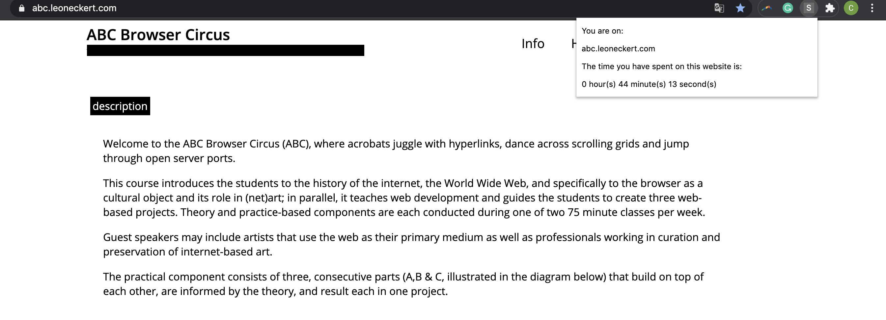

# SEIZE YOUR TIME

## description
In this project, I build an extension that can record the time you have opened a website. clicking on the extension, you will able to see which website you are on and for how long you have opened it (since you loaded the extension). The extension will only consider the domain you visited (for example, google.com rather than google.com/abcdejioa). 

clicking [here](https://github.com/ql816/abc-student-repo/raw/master/projects/miniproject5/Seize_your_time.zip) to download the extension!

## Demo

